Please find the mermaid flow of platform hal L2 Test cases:

### Test Function Name : test_l2_platform_hal_getset_TelnetEnable

### Test Function Name : test_l2_platform_hal_getset_SSHEnable

### Test Function Name : test_l2_platform_hal_getset_SNMPEnable

### Test Function Name : test_l2_platform_hal_getset_WebUITimeout

### Test Function Name : test_l2_platform_hal_Memused_lesserthanor_equalto_flashMemory

```mermaid
flowchart TD
    A[Start Test Case 5] --> B[Invoke platform_hal_GetHardware]
    B -->|Success| C[Invoke platform_hal_GetHardware_MemUsed]
    B -->|Failure| X[Test Case Fail<br>platform_hal_GetHardware Failed]
    C -->|Success| D{Verify <br>Used Memory <= Total Flash Size}
    C -->|Failure| Y[Test Case Fail<br>platform_hal_GetHardware_MemUsed Failed]
    D -->|Yes| E[End Test Case<br>Success]
    D -->|No| F[Test Case Fail<br>Used Memory Exceeds Total Flash Size]
```

### Test Function Name : test_l2_platform_hal_MemFree_lesserthanor_equalto_flashMemory

### Test Function Name : test_l2_platform_hal_checksumof_memusedandfree_equals_totalflash

### Test Function Name : test_l2_platform_hal_checkusedmemory_lesserthanor_equals_totalDRAM

### Test Function Name : test_l2_platform_hal_checkfreememory_lesserthanor_equals_totalDRAM

### Test Function Name : test_l2_platform_hal_checksumof_usedandfree_memory_equals_totalDRAM

### Test Function Name : test_l2_platform_hal_verify_factoryresetcount_afterclearing

### Test Function Name : test_l2_platform_hal_getset_FactoryCmVariant

### Test Function Name : test_l2_platform_hal_getset_Led

### Test Function Name : test_l2_platform_hal_getset_MACsecEnable

